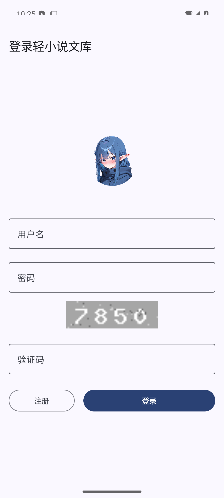
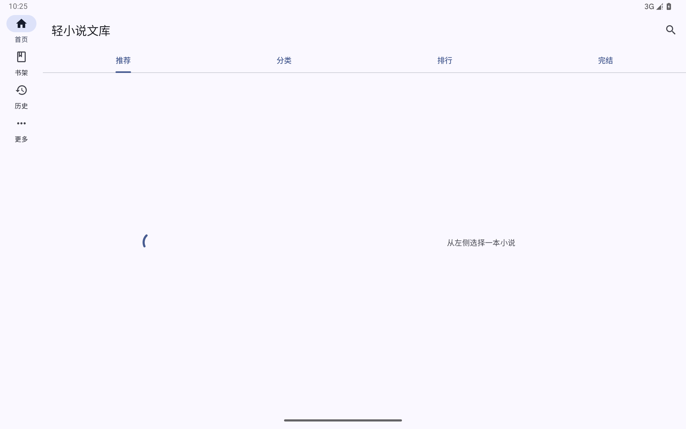
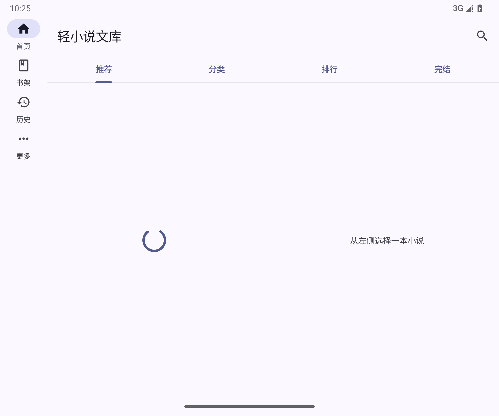
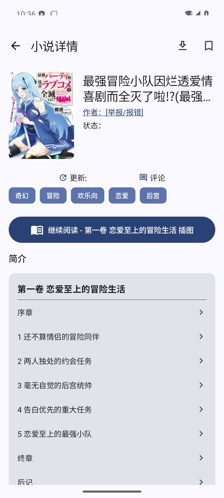
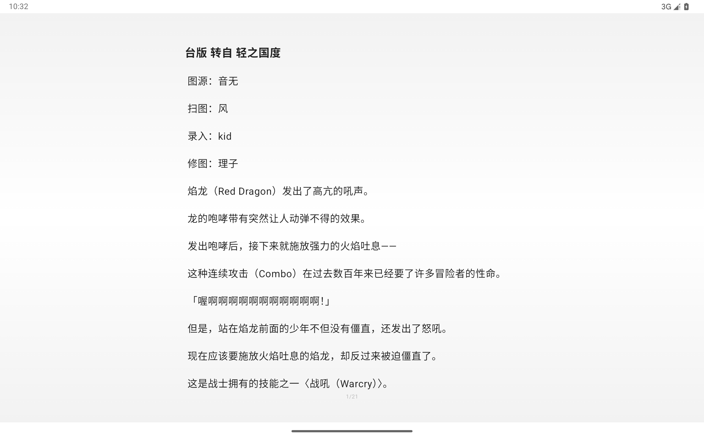
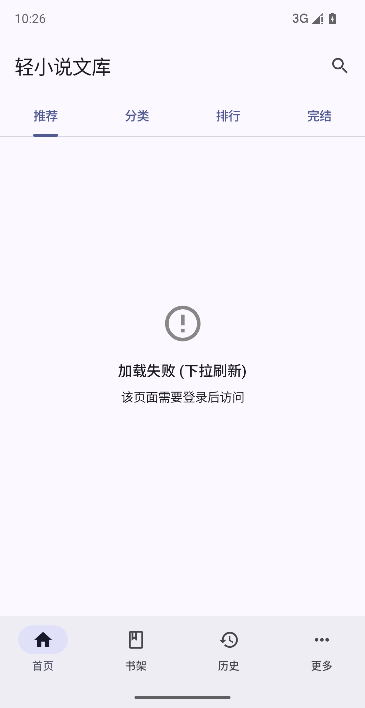
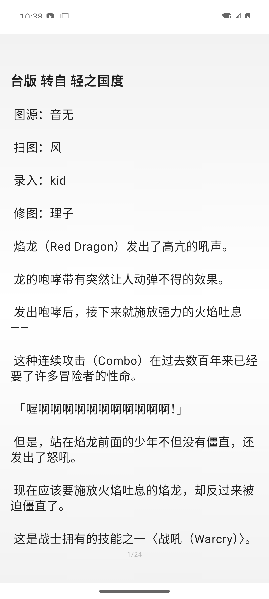
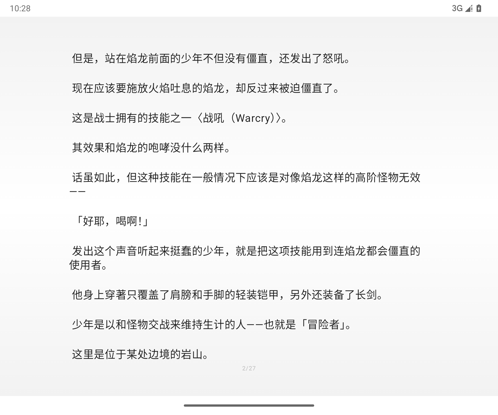
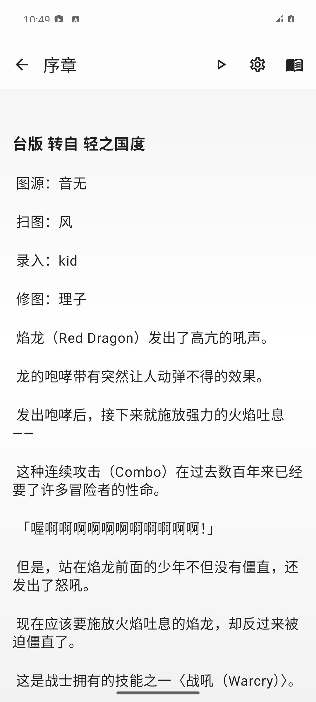

# wild-android

Wild 轻小说文库的安卓原生复刻 —— Kotlin + Jetpack Compose + Material 3（含 Expressive）+ 多设备自适应。Android-native rewrite of the Wild Wenku8 client.

> 当前为 **全量接线阶段**（Stage 4）：真实 Wenku8 数据源（HTML 抓取 + CF 绕过）已接通全部界面，含阅读器双模式、下载引擎与历史/书架/账户。架构见 `docs/architecture.md`；复刻基准见 SZKM-48 的 `wild-spec.md`。

## 技术栈

| 层 | 选型 | 说明 |
|---|---|---|
| UI | Jetpack Compose + Material 3 1.4.0（Compose BOM 2026.09.00） | 唯一设计规范；Material Expressive 组件随 BOM 可用 |
| 自适应 | `material3.adaptive*` 1.3.0（NavigationSuiteScaffold + WindowSizeClass） | 窄屏 bottom bar / 宽屏 nav rail，屏幕尺寸→导航形态在 `WildNavShell` 集中映射 |
| 架构 | MVVM + 单一数据源 | UI(Compose) → ViewModel → Repository → DataSource/DAO |
| DI | Koin 4.2.2 | 比 Hilt 少一层 KSP 编译链，Compose 集成直接；模块起步小，后续可按需迁 |
| 网络 | OkHttp 5.5.0 + Jsoup 1.23.2 | 混合数据通道：网页 HTML 抓取（复刻现状）+ 章节正文走 XML API（决策 A） |
| 持久化 | Room 2.8.5（KSP） + DataStore Preferences | Room 表对齐 spec §3.5 存储模型；设置项走 DataStore（`property` 表的等价物） |
| 图片 | Coil 3.6.3 | |
| 异步 | Coroutines + Flow | |
| 构建 | Gradle 9.7.1 + Kotlin DSL + Version Catalog + **AGP 9.4.1 内建 Kotlin**（`android.builtInKotlin`） | 不再单独 apply kotlin-android 插件 |
| SDK | compileSdk `android-37.2` / targetSdk 37 / minSdk 26 | 本机平台为 37.2 次版本；AGP 9.x `compileSdk { release(37) { minorApiLevel = 2 } }` |

## 环境要求

- JDK 17（Temurin 17.0.20+）
- Android SDK：`platforms;android-37.2`（或 `platforms;android-36` + 改 compileSdk）、`build-tools;36.0.0`、`platform-tools`
- `ANDROID_HOME`/`sdk.dir` 指向 SDK（本机：`~/Android/Sdk`；已写 `local.properties`）
- 需要能访问 Maven Central / Google Maven；若网络只能走代理，把代理写进 `~/.gradle/gradle.properties`（`systemProp.https.proxyHost/Port`），不要写进仓库内的 `gradle.properties`。

## 使用说明

- **安装**：用 `app-debug.apk`（见 SZKM-52 交付附件）`adb install` 或侧载安装；包名 `app.wild.android`，应用名「轻小说文库」，minSdk 26。
- **启动**：首次启动走初始化页 → 未登录落到登录页；登录需 wenku8 账号 + 验证码（验证码可点击刷新）。
- **深链**：`wild://app/<route>` 可直达各页：`home`、`bookshelf`、`history`、`more`、`novel/{aid}`、`reader/{aid}/{cid}`、`novel/{aid}/reviews`、`novel/{aid}/download-select`、`search?type=&key=`、`category?tag=`、`settings`、`account`、`about`、`downloads`、`download/{aid}`。
- **已知环境依赖**：wenku8.net 有 Cloudflare 拦截 + `modules/article/*` 要求登录态；匿名态下列表页可能显示「站点防护验证未通过」（实为站点要求登录，见验收报告）。

## 界面实拍（v0.1.0 验收截图）

| 手机 | 平板 | 折叠屏 |
|---|---|---|
|  |  |  |
|  |  |  |
|  | |  |
|  | | |

## 构建

```bash
./gradlew assembleDebug    # 产出 app/build/outputs/apk/debug/app-debug.apk
./gradlew lintDebug        # lint
```

CI：`.github/workflows/android-ci.yml`（assembleDebug + lint + APK artifact）。

## 仓库结构

```
app/src/main/java/app/wild/android/
├── WildApp.kt               # @Application + Koin 启动
├── MainActivity.kt          # enableEdgeToEdge + 主题模式接线 + WildNavShell
├── di/AppModule.kt          # Koin 模块（DB / DAO / SettingsStore / Repository）
├── data/
│   ├── local/               # Room：Entities + Daos + WildDatabase（对齐 spec §3.5）
│   ├── prefs/SettingsStore.kt   # DataStore（主题模式 / API Host / 阅读器设置）
│   ├── remote/              # Wenku8DataSource 接口 + Wenku8HtmlSource(Jsoup)
│   │                        #   + Wenku8Client(OkHttp/cookie/接口缓存) + CfSession(CF状态机)
│   ├── download/            # DownloadEngine（章级状态机 + filesDir 落盘）
│   └── repository/          # LibraryRepository / SessionRepository / ReaderContentSource
└── ui/
    ├── theme/Theme.kt       # MD3：动态取色 + 浅/深 fallback scheme
    ├── navigation/WildNavShell.kt  # NavigationSuiteScaffold + WindowSizeClass→导航形态
    └── screen/              # HomeScreen（3 列封面网格占位）/ 书架 / 历史 / 更多占位
```

## 规格决策在骨架中的落点

- **决策 A（正文通道）**：`Wenku8DataSource.chapterText()` 是唯一入口；Stage 4 落 `Wenku8HtmlSource` + `Wenku8XmlApiSource` 两实现，Repository 无感。
- **决策 B（书架写操作）**：接口保留 302 语义与 CF 兜底位（`bookshelfAdd/Remove/Move`）；「删除=移到 -1」在 UI 文案如实表述（Stage 3）。
- **决策 C（进度恢复）**：`ReadingHistoryEntity.progress`（累计文本字数）为恢复锚点；`progressPage` 仅展示。

## 多设备验收

导航形态随窗口宽度自动切换：手机（compact）底部导航栏；平板/折叠屏展开（medium/expanded）导航轨。截图见 SZKM-49 issue 评论区。
